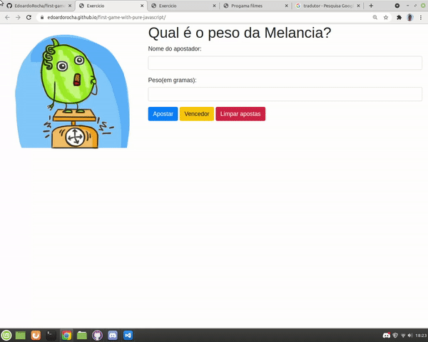

<h1 align="center"> game-which-watermelon </h1>
 
 
 
 
 
 
 

 
 
 > status: Concluded ✔️
 
 
 
 ## How to use this algorithm?

1. Add players and values in (GM)
     + Add players and stake amounts for each player and click "Add"
2. Select watermelon weight
     + Ask someone who didn't bet to choose the weight of the watermelon to be said the champion
3. remove game
     + To restart the game just select "Restart" to restart the game

## What does this algorithm consist of?

This algorithm consists of, as soon as it is loaded, it generates a random number from 1 to 100, so you can bet any number within this limit of 6 chances, if you exceed the algorithm, it ends by releasing the "Play Again" input

## Technologies used

<table> 
 <tr>
  <td>JavaScript</td>
  <td>HTML</td>
  <td>CSS</td>
  <td>Bootstrap</td>
 </tr>
 <tr> 
  <td> ECMAS v8.0</td>
  <td> v5.0 </td>
  <td>v3.0</td>
  <td>v4.0.0</td>
 </tr>
</table>

## License
Repository covered by [MIT](http://escolhaumalicenca.com.br/licencas/mit/) license
